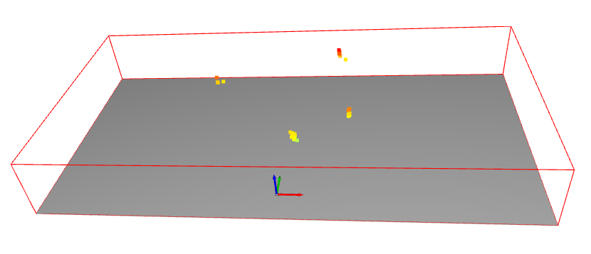

Open3D Demonstration
============================

This sample application is a simple example of using the RadarIQ 
sensor with the Open 3D library.

.

Installation:
-------------
1. Create a virtual env for this project

``python -m venv venv``

2. Activate the virtual env

* Windows: ``venv\scripts\activate``
* Linux: ``source venv/bin/activate``

3. Install requirements
``pip install -r requirements.txt``

OR:

Simply click on the "install" batch file and it will install
all the files required.

Usage:
------
1. Run the application
   enter ``python open3D.py`` in cmd after installation

## License
Copyright 2021 RadarIQ, Ltd

Permission is hereby granted, free of charge, to 
any person obtaining a copy of this software and 
associated documentation files (the "Software"), 
to deal in the Software without restriction, 
including without limitation the rights to use, 
copy, modify, merge, publish, distribute, 
sublicense, and/or sell copies of the Software, 
and to permit persons to whom the Software is 
furnished to do so, subject to the following 
conditions:

The above copyright notice and this permission notice 
shall be included in all copies or substantial 
portions of the Software.

THE SOFTWARE IS PROVIDED "AS IS", WITHOUT WARRANTY OF 
ANY KIND, EXPRESS OR IMPLIED, INCLUDING BUT NOT LIMITED 
TO THE WARRANTIES OF MERCHANTABILITY, FITNESS FOR A 
PARTICULAR PURPOSE AND NONINFRINGEMENT. IN NO EVENT 
SHALL THE AUTHORS OR COPYRIGHT HOLDERS BE LIABLE FOR 
ANY CLAIM, DAMAGES OR OTHER LIABILITY, WHETHER IN AN 
ACTION OF CONTRACT, TORT OR OTHERWISE, ARISING FROM, 
OUT OF OR IN CONNECTION WITH THE SOFTWARE OR THE USE 
OR OTHER DEALINGS IN THE SOFTWARE.

